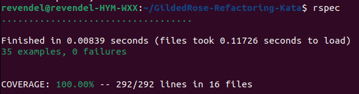

# GildedRose Refactoring in Ruby

Рефакторинг на Ruby исходного кода задачи [Gilded Rose](https://github.com/emilybache/GildedRose-Refactoring-Kata).
Условие задачи: [Ссылка](https://github.com/emilybache/GildedRose-Refactoring-Kata/blob/master/GildedRoseRequirements_ru.txt).
<br><br>

  Исходный код программы помещен в файл [gilded_rose_original.rb](https://github.com/revendel1/GildedRose-Refactoring-Kata/blob/main/gilded_rose_original.rb). Основными проблемами данного кода является избыточная длина и глубокая вложенность метода `update_quality` в классе `GildedRose` из-за большого количества различных условий. Кроме того, серьезным недостатком является то, что вся бизнес-логика проекта сосредоточена в этом одном методе. В ходе анализа предметной области задачи установлено, что существует несколько типов товаров, каждый из которых обладает своими собственными чертами (разная величина изменения значения атрибута `quantity`) и в то же время они все имеют что-то общее (одинаковые атрибуты). Это наталкивает на идею использования концепции наследования между классами, созданными для каждого из данных в условии типов товаров, где каждый класс содержит свою собственную бизнес-логику. В такой архитектуре исходный класс `Item` рассматривается, как класс-родитель. Для него реализовано два потомка, первый из которых, `CommonItem`, нужен для обычных товаров у которых уменьшается срок годности и изменяется значение величины качества товара. Второй потомок `LegendaryItem` нужен для легендарных товаров, у которых не меняется качество и которые не имеют срока годности.  
От класса `CommonItem` в свою очередь наследуются классы для товаров `Aged Brie`, `Backstage passes` и `Conjured` для которых является верным, что значение срока годности каждый день уменьшается на одно и то же значение что и у класса `CommonItem`, однако значения их качеств `quantity` меняются своими собственными способами.  
Иерархия созданной модели классов [представлена ниже](https://github.com/revendel1/GildedRose-Refactoring-Kata/tree/main#диаграмма-классов).  
Работа с проектом реализуется путем создания объекта класса `GildedRose`, представляющего собой нашу гостиницу, имеющую свою собственную лавку товаров. В конструктор создаваемого объекта нужно передать массив объектов класса `Items`. Для каждого элемента данного массива с помощью модуля `TypesParser` ищется соответствующий ему класс разработанной иерархии, содержащий всю необходимую бизнес-логику для данного элемента. Данное решение о парсинге полученных элементов принято с целью не изменять существующее соглашение об инициализации объекта класса `GildedRose`, конструктор которого в исходном коде принимает в качестве своего единственного аргумента массив объектов класса `Item`. С помощью метода `update_quality` можно обновить значение качества и срока годности для каждого из товаров гостиницы `GildedRose`. Также реализована возможность добавления нового товара (метод `add_item` класса `GildedRose`) в ходе работы над заданием по добавлению нового функционала в случае, если ассортимент товаров гостиницы будет и в дальнейшем продолжать меняться (в условии, например, сказано что гостиница нашла себе поставщика нового типа товаров). Геттер для атрибута items добавлен с целью удобства получения текущих значений товаров гостиницы в случае, если сеть гостиниц будет в дальнейшем расширяться и в связи с этим будут созданы новые экземпляры класса `GildedRose`, что сделает проблематичным обращение к нужным объектам класса `Item` или его потомков.  
Преимуществом созданной архитектуры классов является соответствие принципу открытости-закрытости и принципу подстановки Лисков (open-closed и Liskov substitution principles от принципов SOLID), которым не соответствовал исходный код, в котором перед каждым обновлением атрибутов проверялся тип изменяемого объекта, а при появлении нового типа товаров пришлось бы менять исходную функцию. В созданной же в ходе работы над данным проектом архитектуре, полностью отпадает необходимость изменять код класса `Gilded rose`. Вместо этого достаточно создать новый класс, наследуемый от класса `CommonItem` и реализовать в его методе `update_quanity` всю логику для нового товара и после этого добавить имя нового класса в хэш `TYPES` модуля `TypesParser`. В случае, если новый товар соответствует общим правилам для легендарных товаров(не имеет срока годности и его качество константно) или обычных товаров(срок годности и качество каждый день уменьшается на единицу и качество лежит в диапазоне от 0 до 50), то нет никакого смысла менять что-то в проекте.
<br><br>
## Окружение
- Проект разрабатывается на языке Ruby версии 3.2.1
- Зависимости проекта:
  - rspec v3.12.0,
  - rubocop v1.57.2,
  - rubocop-rspec v2.25.0,
  - simplecov v0.22.0,
  - simplecov-console v0.9.1
- Группы зависимостей:
  - :development
  - :test
- Версия Bundler: 2.4.17
- Платформа: x86_64-linux.

## Установка
1. Установите Ruby:  
Если у Вас еще нет Ruby v3.2.1 вы можете скачать и установить его с официального [веб-сайта Ruby](https://www.ruby-lang.org/).
2. Установите Bundler
```
gem install bundler
```
3. Скопируйте проект
```
https://github.com/revendel1/GildedRose-Refactoring-Kata.git
```
4. Перейдите в директорию проекта
```
cd GildedRose-Refactoring-Kata
```
5. Установите зависимости
```
bundle install
```

## Использование
1. Создайте новый файл с расширением `.rb`, либо запустите оболочку IRB командой
```
irb
```
2. Подключите используемые файлы
```
require './lib/gilded_rose'
require './lib/types_parser'
require './lib/item'
```
3. Создайте массив объектов класса Item, указав для каждого из них его имя, срок годности и качество
Например:
```
items = [
  Item.new(name="Aged Brie", sell_in=2, quality=0),
  Item.new(name="Elixir of the Mongoose", sell_in=5, quality=7),
  Item.new(name="Sulfuras, Hand of Ragnaros", sell_in=0, quality=80),
]
```
4. Создайте экземпляр класса `GildedRose`, передав в его конструктор созданный на предыдущем шаге массив
5. Вызовите метод `update_quality` у экземпляра `GildedRose` столько раз, сколько прошло дней
6. Обратившись к аттрибуту `items` экземпляра класса `GildedRose` можно увидеть, как поменялись значения качества товаров `quantity` и их срок годности `sell_in`.
<br><br>

Пример использования реализованного кода представлен в файле `texttest_fixture.rb`  
Запустить его можно командой консоли `ruby texttest_fixture.rb`


## Тесты

Запустить тесты можно командой:
```
bundle exec rspec
```
В консоль выведется результат прошедших тестов и процент их покрытия.


## Диаграмма классов

